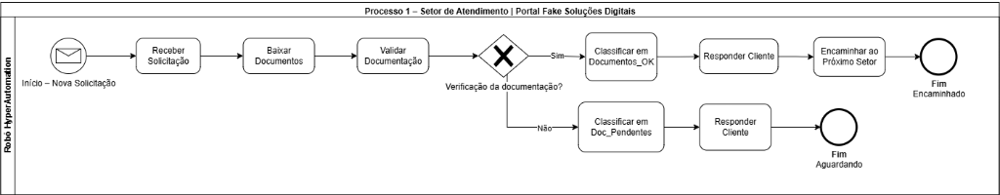
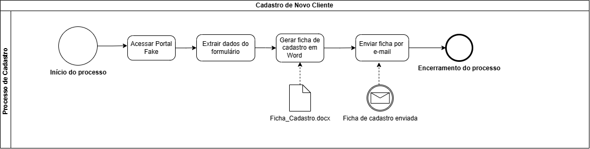

# HyperAutomation — Portal Fake Soluções Digitais

Projeto de automação desenvolvido como atividade da disciplina de
**Técnicas de Hyperautomation** (AX Academy / IFAM).

O sistema automatiza processos do Portal Fake Soluções Digitais por meio
de robôs Python + Playwright, integrando leitura/envio de e-mails,
geração de documentos e classificação de arquivos.

---

## Módulos Implementados

| Módulo | Descrição | Branch/Release |
|---|---|---|
| **Cadastro** (original) | Extrai dados do Portal Fake, gera ficha Word e envia por e-mail | `release/1.0` |
| **Processo 1 — Atendimento** | Recebe solicitações por e-mail, valida documentação, classifica e responde | `release/2.0` |

---

## Processo 1 — Setor de Atendimento

### BPMN — Modelagem do Processo



### Fluxo do Processo

```
Receber Solicitação (IMAP)
   ↓
Baixar Documentos (anexos → ERP_Portal_Fake/Downloads/)
   ↓
Validar Documentação
   ↓ Completa?
  Sim → Documentos_OK/ → Responder (confirmação) → Encaminhados/
  Não → Documentos_Pendentes/ → Responder (pendência)
```

### Critério de Documentação Completa

A solicitação é considerada **completa** quando contém anexos para as 3 categorias:

| Categoria | Exemplos de arquivo aceito |
|---|---|
| `documento_identidade` | `rg_frente.pdf`, `cnh.jpg`, `passaporte.pdf` |
| `comprovante_residencia` | `comprovante_residencia.pdf`, `conta_luz.jpg` |
| `ficha_cadastro` | `ficha_cadastro.pdf`, `formulario.pdf` |

A detecção é feita por **palavras-chave no nome do arquivo** (case-insensitive), consistente com as instruções da ficha de cadastro Word gerada no Processo de Cadastro.

### Estrutura ERP_Portal_Fake

```
ERP_Portal_Fake/
├── Downloads/             ← anexos baixados do e-mail (processamento)
├── Documentos_OK/         ← solicitações com documentação completa
├── Documentos_Pendentes/  ← solicitações aguardando documentos
└── Encaminhados/          ← prontos para o próximo setor
```

### Justificativa das Bibliotecas

| Biblioteca | Uso | Justificativa |
|---|---|---|
| `imaplib` | Leitura de e-mails | stdlib Python — sem dependência extra; consistente com `smtplib` já usado |
| `smtplib` | Envio de respostas | já usado no projeto (reutilizado via `envio_email.py`) |
| `shutil` | Movimentação de pastas | stdlib Python — operação de arquivos simples e auditável |
| `logging` | Registro de execução | stdlib Python — padrão de logging estruturado |
| `pathlib` | Manipulação de caminhos | já adotado no projeto |
| `Pillow` | Geração do PNG do BPMN | única dependência nova; geração programática de imagem |

---

## BPMN — Processo de Cadastro (original)



---

## Pré-requisitos

- Python 3.10 ou superior
- Google Chrome / Chromium instalado

## Instalação

```bash
# 1. Clone o repositório
git clone https://github.com/CodeMartell/HyperAutomation.git
cd HyperAutomation

# 2. Crie e ative o ambiente virtual
python -m venv .venv
source .venv/bin/activate   # Linux/macOS
# .venv\Scripts\activate    # Windows

# 3. Instale as dependências
pip install -r requirements.txt

# 4. Instale os navegadores do Playwright
playwright install chromium
```

## Configuração

Copie o arquivo de exemplo e preencha com suas credenciais:

```bash
cp .env.example .env
```

### Variáveis de ambiente

| Variável | Descrição | Processo |
|---|---|---|
| `EMAIL_REMETENTE` | E-mail do remetente (ex: `romulolira1@gmail.com`) | Cadastro + Atendimento |
| `EMAIL_SENHA` | Senha de app (não a senha principal) | Cadastro + Atendimento |
| `EMAIL_DESTINATARIO` | Destinatário da ficha de cadastro | Cadastro |
| `SMTP_HOST` | Servidor SMTP (padrão: `smtp.gmail.com`) | Cadastro + Atendimento |
| `SMTP_PORT` | Porta SMTP (padrão: `587`) | Cadastro + Atendimento |
| `IMAP_HOST` | Servidor IMAP (padrão: `imap.gmail.com`) | Atendimento |
| `IMAP_PORT` | Porta IMAP (padrão: `993`) | Atendimento |
| `IMAP_USER` | Usuário IMAP (fallback: `EMAIL_REMETENTE`) | Atendimento |
| `IMAP_PASSWORD` | Senha IMAP (fallback: `EMAIL_SENHA`) | Atendimento |
| `PORTAL_FAKE_URL` | _(opcional)_ URL personalizada do portal | Cadastro |

> **Nota:** Para Gmail, gere uma [Senha de App](https://myaccount.google.com/apppasswords).
> A mesma senha de app pode ser usada para SMTP e IMAP.

## Execução

### Processo de Cadastro (original)

```bash
python source/main.py
```

### Processo 1 — Atendimento (com e-mail real)

```bash
python source/atendimento/main_atendimento.py
```

### Simulação end-to-end (sem e-mail real)

```bash
python source/atendimento/simular_atendimento.py
```

A simulação demonstra o fluxo completo com arquivos de teste criados localmente.
Nenhuma conta de e-mail é necessária.

---

## Estrutura do Projeto

```
HyperAutomation/
├── .env.example                   # Template de variáveis de ambiente
├── .gitignore
├── README.md
├── requirements.txt               # Dependências Python
├── images/
│   ├── ficha_portal_fake_sd_bpmn.drawio     # BPMN Cadastro (editável)
│   ├── ficha_portal_fake_sd_bpmn.png        # BPMN Cadastro (exportado)
│   ├── Processo01_Atendimento.drawio        # BPMN Atendimento (editável)
│   └── Processo01_Atendimento.png           # BPMN Atendimento (exportado)
├── ERP_Portal_Fake/
│   ├── Downloads/                 # Anexos baixados (processamento)
│   ├── Documentos_OK/             # Documentação completa
│   ├── Documentos_Pendentes/      # Documentação incompleta
│   └── Encaminhados/              # Próximo setor
├── portal_fake/
│   └── index.html                 # Mock do Portal Fake
├── resources/
│   └── ficha_cadastro_*.docx      # Fichas geradas
├── evidencias/
│   ├── 01_portal_fake_extracao.png
│   └── atendimento.log            # Log do Processo 1
└── source/
    ├── main.py                    # Orquestrador — Processo Cadastro
    ├── extracao.py                # Extração de dados (Playwright)
    ├── documento_email.py         # Geração da ficha Word
    ├── envio_email.py             # Envio de e-mail (smtplib)
    └── atendimento/               # Módulo — Processo 1
        ├── __init__.py
        ├── leitura_email.py       # Leitura de e-mails (imaplib)
        ├── validacao.py           # Validação de documentação
        ├── classificacao.py       # Classificação de arquivos
        ├── resposta_cliente.py    # Resposta automática ao cliente
        ├── main_atendimento.py    # Orquestrador do Processo 1
        └── simular_atendimento.py # Simulação end-to-end
```

---

## GitFlow

```
main ← release/1.0 (Processo Cadastro)
main ← release/2.0 (Processo 1 — Atendimento)

develop
  └─ feature/extracao          (merged)
  └─ feature/documento-email   (merged)
  └─ feature/processo-atendimento → release/2.0 → main
```

## Equipe

| Integrante | Responsabilidade |
|---|---|
| _Romulo Lira_ | _Líder do projeto, integração dos módulos, GitFlow e versionamento_ |
| _Huan Cruz De Oliveira_ | _Modelagem BPMN e documentação visual_ |
| _Gilvan Daniel da Silva_ | _Geração da ficha de cadastro em Word (.docx)_ |
| _Jannas_ | _Extração de dados do Portal Fake (Playwright)_ |

## Licença

Projeto acadêmico — AX Academy / IFAM.
