# Evolução dos Processos — Antes vs. Agora (Processos 3, 4 e 5)

Este documento apresenta a análise comparativa entre o modelo operacional **Antes (Legado / Manual)** e o modelo **Agora (HyperAutomation Integrado)**, detalhando o funcionamento e as melhorias implementadas nos **Processos 3, 4 e 5**.

---

## 1. Visão Geral da Transformação

```mermaid
flowchart TD
    subgraph ANTES ["ANTES (Legado / Operação Manual)"]
        A1[Processo 3: Cadastro Manual sem Validação de Duplicidade] -->|Sem protocolo| A2[Processo 4: SAC Manual e Comunicação Não Rastreada]
        A2 -->|Sem histórico central| A3[Processo 5: Planilhas Manuais e Falta de KPIs]
    end

    subgraph AGORA ["AGORA (HyperAutomation Integrado)"]
        B1["Processo 3: Cadastro Automático + Validação + Fallback"] -->|Status & Retorno| B2["Processo 4: SAC Automático + Protocolo SAC + Registro JSON"]
        B2 -->|Payload Estruturado| B3["Processo 5: Relatórios em Tempo Real + KPIs + Versionamento"]
    end

    style ANTES fill:#ffebee,stroke:#c62828,stroke-width:2px
    style AGORA fill:#e8f5e9,stroke:#2e7d32,stroke-width:2px
```

---

## 2. Comparativo Detalhado — Antes vs. Agora

| Dimensão | Como era ANTES (Legado) | Como é AGORA (HyperAutomation) |
|---|---|---|
| **Processo 3 (Cadastro)** | Processamento manual ou isolado; sem validação prévia de CPF ou duplicidades; qualquer erro derrubava a operação. | **100% Automatizado**: validação estruturada de campos, checagem prévia de duplicidade por CPF, integração com API externa e mecanismo de **fallback** em caso de indisponibilidade. |
| **Processo 4 (SAC / Comunicação)** | Comunicação manual via e-mail; sem geração de protocolos; atendimentos não registrados; perda de solicitações com falha de envio. | **Autônomo & Auditável**: geração automática de protocolo (`SAC-YYYYMMDD-XXXX`), classificação do status (`CONCLUIDO`, `ALERTA_DUPLICIDADE`, `PENDENCIA_TECNICA`), envio por e-mail (SMTP/Simulado) e persistência em `registro_atendimentos_sac.json`. |
| **Processo 5 (Relatórios & Métricas)** | Coleta manual de dados ao fim do mês; planilhas desconectadas; ausência de indicadores operacionais e tempo de execução. | **Consolidação em Tempo Real**: métricas de desempenho (latência em ms), taxa de sucesso percentual, contagem de fallbacks/duplicidades e geração de relatórios JSON versionados (`relatorio_gerencial_*.json`). |
| **Resiliência e Falhas** | Interrupção em caso de erro (crash); sem retenção ou reprocessamento. | **Resiliente com Contingência**: tratamento de exceções em todas as etapas, garantindo que o fluxo prossiga para a gestão mesmo em cenários de erro. |
| **Tempo de Execução (SLA)** | Horas ou dias para processar cada lote de clientes. | **Sub-segundo (Milissegundos)** por atendimento. |

---

## 3. Explicação Completa dos Processos 3, 4 e 5

### 3.1 Processo 3 — Setor de Cadastro (`processo3/cadastro.py`)
Responsável por validar a entrada de dados do cliente vinda da organização e efetuar o cadastro na API do sistema.

- **Fluxo Interno**:
  1. **Validação de Entrada (`validar_cliente`)**: Verifica se os campos obrigatórios (`nome`, `email`, `cpf`) estão presentes e preenchidos.
  2. **Idempotência (`verificar_duplicidade`)**: Varre a base para identificar se o CPF já se encontra cadastrado, evitando registros duplicados.
  3. **Integração com API Externa (`integrar_api_cadastro`)**: Transmite os dados para a API externa e recebe o identificador único gerado (`id_cliente`).
  4. **Contingência (`fallback_cadastro`)**: Em caso de queda de conexão ou erro da API, o sistema captura a exceção e aciona o fallback sem interromper o pipeline.

---

### 3.2 Processo 4 — Setor de SAC (`processo4/sac.py`)
Responsável pelo recebimento do resultado do Processo 3, tratamento das mensagens, emissão de protocolo, comunicação com o cliente e registro do atendimento.

- **Fluxo Interno**:
  1. **Verificação do Status (`verificar_status_p3`)**: Analisa o retorno do Processo 3 e categoriza entre:
     - `CADASTRO_SUCESSO`: Cadastro concluído na API.
     - `CADASTRO_DUPLICADO`: Cliente já cadastrado previamente.
     - `CADASTRO_FALHA`: Erro técnico/API no cadastro.
  2. **Tratamento do Resultado (`tratar_resultado_sac`)**: Gera o protocolo único de atendimento (`SAC-YYYYMMDD-XXXX`), seleciona o template de mensagem e define o status funcional.
  3. **Comunicação com o Cliente (`comunicar_cliente`)**: Transmite o e-mail de notificação (via SMTP real ou envio seguro simulado). Se o envio falhar, altera o status para `COMUNICACAO_RETIDA`.
  4. **Registro do Atendimento (`registrar_atendimento`)**: Grava a transação completa no arquivo JSON `ERP_Portal_Fake/atendimentos/registro_atendimentos_sac.json` e na memória.
  5. **Monitoramento da Execução**: Registra métricas de tempo de resposta em milissegundos e prepara a carga padronizada para o Processo 5 (`dados_prontos_para_p5=True`).

---

### 3.3 Processo 5 — Relatórios & Gerência (`processo5/relatorios.py`)
Responsável por consolidar os dados do Processo 4, calcular métricas de desempenho e emitir relatórios gerenciais auditáveis.

- **Fluxo Interno**:
  1. **Validação da Carga (`validar_dados_processo4`)**: Garante a integridade da estrutura recebida do SAC.
  2. **Cálculo de Métricas (`gerar_metricas`)**: Apura indicadores consolidados:
     - Total de atendimentos processados;
     - Cadastros concluídos com sucesso;
     - Quantidade de duplicidades tratadas;
     - Pendências técnicas identificadas;
     - Taxa de sucesso operacional percentual ($\%$).
  3. **Geração e Versionamento (`salvar_relatorio`)**: Grava o relatório individual com carimbo de data/hora (`relatorio_gerencial_YYYYMMDD_HHMMSS.json`) e atualiza o histórico acumulado em `historico_relatorios.json`.

---

## 4. Benefícios Obtidos com a Automação

1. **Rastreabilidade Ponta a Ponta**: Cada solicitação possui protocolo de atendimento SAC único e registros em JSON.
2. **Alta Resiliência (Zero Crashes)**: Todas as etapas contam com blocos `try/except` e funções de `fallback` dedicado.
3. **Métricas Gerenciais Automatizadas**: Gestores têm acesso imediato ao painel de desempenho sem necessidade de compilação manual.
4. **Conformidade Operacional**: Eliminação de erros de digitação e duplicidade na base de clientes.
