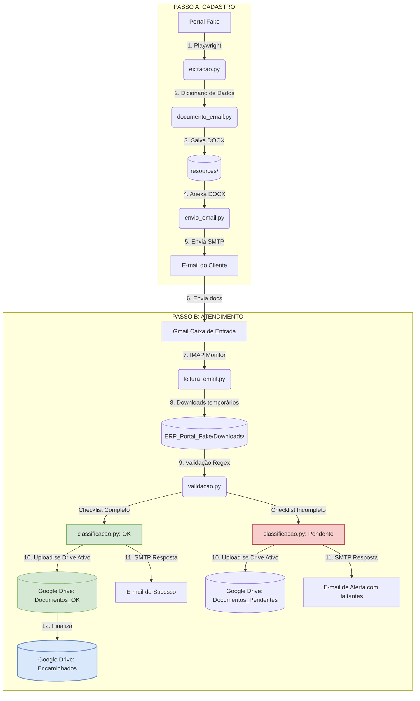

# Relatório Técnico — HyperAutomation Portal Fake
---

## 1. Identificação do Projeto

| Campo | Informação |
|---|---|
| **Projeto** | HyperAutomation — Portal Fake Soluções Digitais |
| **Disciplina** | Técnicas de Hyperautomation |
| **Professor(a)** | Moisés Levy |
| **Turma** | Turma 02 — AX Academy / IFAM |
| **Entrega / Revisão** | 28/07/2026 (Módulo de Atendimento Integrado) |

### Integrantes da Equipe e Responsabilidades

| Integrante | Responsabilidade |
|---|---|
| **Romulo Lira** | Líder do projeto, integração dos módulos, GitFlow, versionamento e refatoração de bugs |
| **Huan Cruz De Oliveira** | Modelagem BPMN e documentação visual |
| **Gilvan Daniel da Silva** | Geração da ficha de cadastro em Word (.docx) |
| **Jannas** | Extração de dados do Portal Fake (Playwright) |

---

## 2. Objetivo da Automação

O projeto **HyperAutomation** consiste em uma suite de robôs projetada para automatizar o ciclo de vida do cadastro e atendimento de clientes do **Portal Fake Soluções Digitais**. A automação elimina tarefas manuais repetitivas, reduz o tempo de resposta e garante a conformidade regulatória através de validações rígidas.

O sistema divide-se em duas automações principais e complementares:

1. **Processo de Cadastro (Original)**:
   - **Extração Web**: Captura dados cadastrais dinâmicos no Portal Fake utilizando Playwright.
   - **Geração de Ficha**: Consolida os dados em uma Ficha de Cadastro estruturada em formato Word (`.docx`).
   - **Comunicação Inicial**: Envia a ficha ao cliente via SMTP (Gmail) solicitando o preenchimento, assinatura e envio dos documentos complementares.

2. **Processo 1 — Setor de Atendimento (Novo)**:
   - **Monitoramento de Inbox**: Lê e-mails não lidos via IMAP filtrando pelo assunto "Atendimento".
   - **Download e Validação**: Baixa os anexos e valida a presença do checklist obrigatório (Identidade, Residência e Ficha Assinada).
   - **Classificação Inteligente**: Separa as solicitações entre válidas (`Documentos_OK`) e pendentes (`Documentos_Pendentes`), organizando-as localmente ou na nuvem (Google Drive Integration).
   - **Resposta Automática**: Envia e-mails SMTP customizados notificando a confirmação de recebimento ou solicitando correções/documentos faltantes.
   - **Encaminhamento**: Transfere pastas aprovadas para a etapa de processamento final (`Encaminhados`).

---

## 3. Modelagem de Processos (BPMN)

Os processos do sistema foram desenhados e padronizados utilizando a notação BPMN 2.0. Os arquivos editáveis `.drawio` foram corrigidos matematicamente para alinhar as raias (lanes), tarefas e gateways de forma 100% simétrica, garantindo setas de fluxo perfeitamente retas e legíveis.

### 3.1 Processo de Cadastro
Responsável pelo fluxo de entrada de dados de novos usuários.


*Figura 1: Fluxo linear de extração, escrita de documento e envio por e-mail.*

**Principais Etapas:**
1. **Início**: Executado manualmente via terminal (`main.py`).
2. **Acessar Portal Fake**: Carrega a interface HTML no navegador Chromium.
3. **Extrair Dados**: Clica no botão "Novo Cadastro" e lê os seletores CSS.
4. **Gerar Ficha Word**: Cria o `.docx` a partir de um dicionário.
5. **Enviar Ficha**: Conecta ao servidor SMTP Gmail e transmite o anexo.

### 3.2 Processo 1 — Setor de Atendimento
Responsável pela triagem de e-mails e validação de documentos submetidos pelos clientes.


*Figura 2: Fluxo condicional com gateway de validação e desvios para OK/Pendente.*

**Principais Etapas:**
1. **Leitura IMAP**: Localiza e-mails não lidos que contêm o termo "Atendimento" no assunto.
2. **Baixar Anexos**: Faz o download temporário dos arquivos de cada e-mail.
3. **Validador de Checklist**: Checa se o remetente enviou a documentação exigida.
4. **Gateway Condicional**:
   - **Se Completo**: Move para `Documentos_OK/`, envia e-mail de sucesso e encaminha a pasta para `Encaminhados/` (Nível Local ou Google Drive).
   - **Se Incompleto**: Move para `Documentos_Pendentes/` e envia e-mail de alerta listando exatamente quais documentos faltam.

---

## 4. Pipeline da Automação

A pipeline do ecossistema HyperAutomation conecta de ponta a ponta as interações do cliente com o sistema de arquivos local e a infraestrutura na nuvem (Google Drive):



---

## 5. Desenvolvimento e Detalhes da Arquitetura

### 5.1 Estrutura do Repositório
```
HyperAutomation/
├── .env.example                   # Template de configurações
├── .gitignore                     # Ignora .env, token.json e caches do Python
├── README.md                      # Instruções de instalação rápidas
├── credentials.json               # Credenciais de API do Google Cloud (Drive)
├── token.json                     # Token de acesso OAuth2 persistido
├── requirements.txt               # Dependências Python
├── relatorio_tecnico.md           # Este relatório técnico completo
├── portal_fake/
│   └── index.html                 # Mock do Portal de Cadastro
├── images/                        # Diagramas BPMN (.drawio e .png)
├── evidencias/                    # Logs e capturas de tela geradas
├── resources/                     # Fichas DOCX geradas na etapa de Cadastro
├── ERP_Portal_Fake/               # Estrutura local do ERP
│   ├── Downloads/
│   ├── Documentos_OK/
│   ├── Documentos_Pendentes/
│   └── Encaminhados/
└── source/                        # Código-fonte
    ├── main.py                    # Orquestrador do Processo de Cadastro
    ├── extracao.py                # Extração via Playwright
    ├── documento_email.py         # Geração do Word
    ├── envio_email.py             # Transmissão SMTP
    └── atendimento/               # Módulo do Processo 1 (Atendimento)
        ├── leitura_email.py       # Leitura IMAP e downloads
        ├── validacao.py           # Validador de checklist e regex
        ├── classificacao.py       # Manipulador de arquivos local/Drive
        ├── resposta_cliente.py    # Resposta automática SMTP
        └── main_atendimento.py    # Orquestrador do Processo 1
```

### 5.2 Dependências Principais e Justificativa de Uso
* **`playwright` (v1.61.0)**: Escolhida pela velocidade de execução e API intuitiva para navegar de modo Headless, essencial para rodar em servidores e contêineres CI/CD.
* **`python-docx` (v1.2.0)**: Permite a escrita nativa de arquivos XML do Office Open XML sem depender de uma instância ativa do Microsoft Word.
* **`google-api-python-client`**: Biblioteca de comunicação oficial do Google para gerenciar a transferência, criação de metadados e controle de pastas no Google Drive de forma nativa e assíncrona.
* **`python-dotenv`**: Carrega o escopo do `.env` na memória do script, protegendo chaves e segredos industriais de commits expostos no GitHub.

---

## 6. Correções de Bugs e Melhorias Recentes

Durante as baterias de testes integrados e auditorias da Semana 06, foram corrigidos dois problemas cruciais no Processo 1:

### 6.1 Correção do Filtro de Assunto Case-Sensitive
* **Bug**: O script buscava no servidor e-mails não lidos via IMAP utilizando `UNSEEN SUBJECT "Atendimento"`. Ao processar localmente a lista, o código realizava a comparação `if filtro_assunto and filtro_assunto not in assunto.lower()`. Como a variável configurada no `.env` era `"Atendimento"` (com 'A' maiúsculo), a verificação contra `assunto.lower()` falhava para todos os e-mails, descartando mensagens válidas.
* **Correção**: Atualizada a condicional no arquivo [leitura_email.py](file:///mnt/projetos/romulus/HyperAutomation/source/atendimento/leitura_email.py) para forçar o `.lower()` em ambas as pontas:
  ```python
  if filtro_assunto and filtro_assunto.lower() not in assunto.lower():
  ```

### 6.2 Correção de Falso Positivo de Identidade (Bug do Substring "id")
* **Bug**: O validador [validacao.py](file:///mnt/projetos/romulus/HyperAutomation/source/atendimento/validacao.py) procurava pela palavra-chave `"id"` para identificar o documento de identidade. No entanto, por usar checagem de substring pura (`palavra in nome_lower`), qualquer arquivo contendo o termo `"residencia"` era classificado incorretamente como documento de identidade (já que "res**id**encia" possui o substring "id"). Isso fazia com que e-mails que continham apenas comprovante de residência e ficha cadastral fossem incorretamente validados como "Completos" (OK).
* **Correção**: Implementada uma lógica baseada em tokens que isola as palavras usando delimitadores comuns de nomes de arquivos (como `_`, `-`, `.` e espaços). As chaves curtas `"id"` e `"rg"` agora passam por validação de contorno exato do token:
  ```python
  nome_sem_ext = Path(nome_arquivo).stem.lower()
  tokens = re.split(r'[_.\-\s]+', nome_sem_ext)
  # ...
  if palavra == "id":
      if "id" in tokens: return True
  elif palavra == "rg":
      if any(t == "rg" or t.startswith("rg") or t.endswith("rg") for t in tokens): return True
  ```

---

## 7. Versionamento e Auditoria GitFlow

O projeto adota o padrão de gerenciamento GitFlow. Os desenvolvimentos são efetuados em branches do tipo `feature/`, integrados na branch `develop`, e promovidos para a `main` por meio de branches de `release/` acompanhadas de tags semânticas.

```
main  <────────────────────────── release/2.0 (Release do Atendimento) 
 ▲                                  ▲
 │                                  │ (PR)
 │                               develop
 │                                  ▲
 └─ release/1.0 (PR) ───────────────┼─ feature/processo-atendimento (merged)
      ▲                             ├─ feature/documento-email (merged)
      │                             └─ feature/extracao (merged)
```

### Histórico de Entregas (Releases)
* **Tag `v1.0`**: Lançamento do Processo de Cadastro básico (Ficha Word + Playwright + Envio SMTP).
* **Tag `v2.0`** (Atual): Lançamento do Processo de Atendimento integrado (Leitura IMAP + Validação de documentos + Integração Google Drive + Respostas Automáticas).

---

## 8. Conclusão

O projeto **HyperAutomation** demonstra de forma prática como a automação de processos de negócios (BPA) pode ser implementada de forma robusta e integrada usando Python e APIs modernas. Ao interligar o fluxo de extração de dados da web com a triagem automática de e-mails, validação rigorosa de anexos e armazenamento estruturado na nuvem, a equipe criou um ecossistema autônomo, resiliente e auditável.

As correções efetuadas na Semana 06 estabilizaram as checagens e mitigaram falhas de segurança nos fluxos de validação de documentos, preparando a aplicação para ser colocada em ambiente de produção com total confiabilidade.
